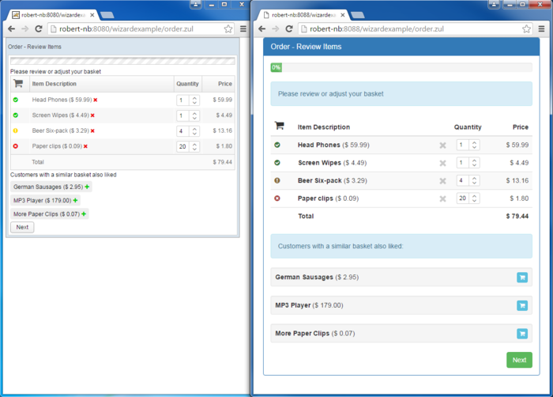

build-lists: true
autoscale: true

# FormBuilder and the Three Virtues of a Programmer

---


# This is Larry Wall

* Larry created perl
* He likes Hawaiian shirts
* Larry's a nice guy
* You can trust Larry

---

# Larry Says:

> The three chief virtues of a programmer are: Laziness, Impatience[,] and Hubris.

---

# Laziness

> The quality that makes you go to great effort to reduce overall energy expenditure. It makes you write labor-saving programs that other people will find useful, and then document what you wrote so you don’t have to answer so many questions about it.

^ This last part is a lie. If people want answers, they should read the code.

---

# Impatience

> The anger you feel when the computer is being lazy. This makes you write programs that don’t just react to your needs, but actually anticipate them. Or at least that pretend to.

---

# Hubris

> Excessive pride, the sort of thing for which Zeus zaps you. Also the quality that makes you write (and maintain) programs that other people won’t want to say bad things about.

---

# Let's talk about Bootstrap

^ Bootstrap is awesome because it makes it look like developers have design skills

---



^ But you have to write an awful lot of HTML to get there

---

## Just one text field

```erb
<div class="form-group">
  <label for="name">What's your name?</label>
  <input type="text" id="author_name" name="author[name]" placeholder="Your name">
  <p class="help-block">This is where you type your name</p>
</div>
```

^ Wouldn't it be better if we could go from that this this...?

---

## Better!

```erb
<%= f.text_field :title, label: "Post Title", input_options: {placeholder: "The title of this post"} %>
```

^ how do we reach this magical land?

---

# Let's Talk About FormBuilder

---

# FormBuilder

* Yielded to when `form_for` or `fields_for` are used
* Where all the form field methods are storeds
* What we're going to subclass from to achieve our goals

---

# What we're going to do...

* Determine where to store our `FormBuilder`
* Subclass from `ActionView::Helpers::FormBuilder`
* Override some of its methods
* Make life a little easier for ourselves

^ Let's get started

---

# Our FormBuilder

```
# config/initializers/bootstraped_form_builder.rb

class BootstrappedFormBuilder < ActionView::Helpers::FormBuilder
end
```

^ Let's see if it works
^ To do that, we'll need to put it in the view

---


^ Whoops.

---

# The View 

```erb
<%# /app/views/authors/new.html.erb %>

<%= form_for @author do |f| %>
  <div class="form-group">
    <%= f.label :name %>
    <%= f.text_field :name, class: "form-control", placeholder: "Name" %>
  </div>

  <div class="form-group">
    <%= f.label :email %>
    <%= f.email_field :email, class: "form-control", placeholder: "Email address" %>
  </div>

  <div class="form-group">
    <%= f.label :bio %>
    <%= f.text_area :bio, class: "form-control", placeholder: "A little about the author" %>
  </div>

  <div class="form-group">
    <%= f.label :role %>
    <%= f.select :role, [["Writer","writer"],["Author","author"],["Commenter","commenter"]], {}, class: "form-control" %>
  </div>

  <div class="checkbox">
    <%= f.label :active do %>
      <%= f.check_box :active %>
      Active
    <% end %>
  </div>

  <%= f.submit class: "brn btn-success" %>

<% end %>
```

^ We need to tell the view to use our FormBuilder

---

# Set the "builder"

```erb
<%= form_for @author, builder: BootstrappedFormBuilder do |f| %>
```

^ - We pass the form\_for method a "builder" argument

^ - Everything should still be working (reload)

^ - Okay. Let's start making some real changes

---

# Text Fields

When we create a `FormBuilder` method we get 5 instance variables

- `@object_name` - The name of the object used in `form_for`
- `@object` - The object itself
- `@options` - The options provided to `form_for`
- `@proc` - The block provided to `form_for`
- `@template` - The current view

^ We're going to need those to override the text field

---

# Text Fields

```ruby
def text_field(method, options={})
  label_text = options.fetch(:label, method.to_s.humanize)
  label_options = options.fetch(:label_options, {})
  input_defaults = {class: "form-control"}
  input_options = merge_options(input_defaults, options.fetch(:input_options, {}))

  @template.content_tag :div, class: "form-group" do
    @template.label(@object_name, method, label_text, label_options) +
      super(method, input_options)
  end
end
```

^ Using the same signature

---

# Text Fields

```ruby
private

def merge_options(defaults, new_options)
  (defaults.keys + new_options.keys).inject({}) {|h,key|
    h[key] = [defaults[key], new_options[key]].compact.join(" ")
    h
  }
end
```

---

# DRYing out


---

# DRYing Out

HTML5 Add a stupid number of new form input types

* phone
* email
* color
* date
* number
* search
* url
* etc.

^ Rails has brought these in as methods in FormBuilder
^ They're all pretty much the same, but with different type values

---

# DRYing Out

```ruby
private

def text_layout(method, options, defaults={})
  label_text = options.fetch(:label, method.to_s.humanize)
  label_options = options.fetch(:label_options, {})
  input_defaults = merge_options({class: "form-control"}, defaults)
  input_options = merge_options(input_defaults, options.fetch(:input_options, {}))

  @template.content_tag :div, class: "form-group" do
    @template.label(@object_name, method, label_text, label_options) +
      yield(method, input_options)
  end
end
```

---

# DRYing out

```ruby
def text_field(method, options={})
  text_layout(method, options, {class: "text-specific-class"}) do |method, input_options|
    super method, input_options
  end
end
```

---

# DRYing out

```ruby
def email_field(method, options={})
  text_layout(method, options) do |method, input_options|
    super method, input_options
  end
end
```

---

# Select boxes

```ruby
def select(method, choices=nil, select_options={}, input_options={}, &block)
  label_text = options.fetch(:label, method.to_s.humanize)
  label_options = options.fetch(:label_options, {})
  input_defaults = {class: "form-control"}
  input_options = merge_options(input_defaults, options.fetch(:input_options, {}))

  @template.content_tag :div, class: "form-group" do
    @template.label(@object_name, method, label_text, label_options) +
      super(method, choices, select_options, input_options, &block)
  end
end
```

---

# Using your FormBuilder

## Creating a Helper Method

```ruby
def bootstrapped_form_for(object, options={}, &block)
  defaults = {builder: BootstrappedFormBuilder}.merge(options)
  form_for object, defaults, &block
end
```

---

# Using your FormBuilder

## Defaulting to your FormBuilder

```ruby
class ApplicationController
  default_form_builder BootstrappedFormBuilder
end
```

---

# Using your FormBuilder

## Defaulting to your FormBuilder

```ruby
# config/initializers/rails_form_builder.rb

class RailsFormBuilder < ActionView::Helpers::FormBuilder
end
```

^ In your view, you just need to set the builder to rails\_form\_builder

---

# FormBuilder Feeds the 3 Virtues

* Laziness - We don't have to write a lot of extra code
* Impatience - We can just write Ruby
* Hubris - We get to write it the "Right way"

---

# Questions?


---

# Samuel Mullen

* t: samullen
* w: pixelatedworks.com
* e: samuel@pixelatedworks.com
