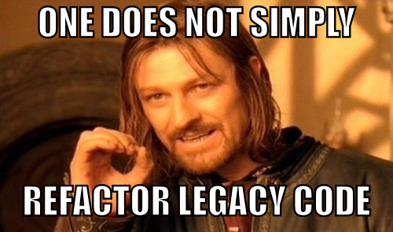

build-lists: true

# **Legacy** isn't a *bad* word

---

---

# *What* is **legacy code**?

---

## **Definition**

"Legacy code is simply code without tests."  
– Michael Feathers

^ His justification
^ "Code without tests is bad code. It doesn’t matter how well written it is; it doesn’t matter how pretty or object-oriented or well-encapsulated it is. With tests, we can change the behavior of our code quickly and verifiably. Without them, we really don’t know if our code is getting better or worse."

---

## **Clarification**

**Legacy code:**

* Cannot be easily changed
* Produces unexpected results when modified
* Affects undefined pieces of the system

^ Even though you may know exactly how everything is connected and behaves, but someone coming to the code for the first time won't

---

# The *problem* with **legacy code**

---

## It's **complicated**

^ It takes a lot of effort to understand
^ Legacy code conjures visions of spaghetti, deeply nested layers of complexity, and if statements nested inside if statements inside case statements inside nested loops.

---

## It's **brittle**

^ Because it's usually complex, we may inadvertently alter the behavior of the code were working with
^ Any modification can have unepected consequences in other areas of the system

---

## It's **demoralizing**

^ It's easier to let the one person who understands it deal with it
^ Reminds us of our shortcomings
^ It tells us it's okay to write garbage code. That what we do as developers doesn't matter

---

# And *here's* the **thing**...

### **Legacy code...**

* is what your organization is built upon
* pays the bills
* isn't going anywhere

^ But all is not without hope

---

# The *opportunity* of **legacy code**

---

## It's an **opportunity** to *learn*

* Understanding the code base == understanding the system and business
* Even old code can teach you new tricks
* Fixing legacy code demands you be better than the code you're fixing

^ I regularly discover new methods, uses of methods, and techniques when working with legacy code

---

## It's an **opportunity** to *add value*

* Efficiency
* The Speed future development
* Improve the quality of the product
* Lower the barrier to entry (for other devs)

^ Legacy code already adds value to your company
^ It may be what made your company profitable to begin with

---

## It's an **opportunity** to do what we *love* 

* We love figuring out solutions to problems
* We love understandnig how things work
* We love creating
* Legacy code provides the opportunities to do all these

^ Think about why you got into technology
^ Most work done by programmers is more chore than problem solving
^ Repairing legacy code is figuring out *new* ways to solve *old* problems

---

---

# Useless Information

Samuel Mullen
@samullen
samuel@pixelatedworks.com
http://pixelatedworks.com
