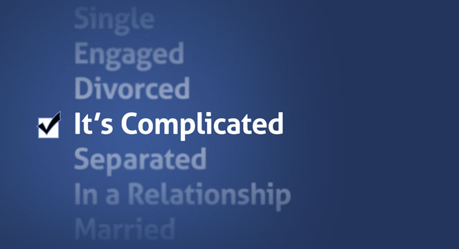

autoscale: true
build-lists: true
theme: Scherzkeks, 7

# **Legacy** Isn't a Bad Word

---

# Hi!

^ Background
^ Started running Linux in '97 the same time I started programming professionally
^ Started web development in '99
^ Used open source languages and technologies that entire time
^ Currenty run Pixelated web development shop focused on rescuing legacy projects
^ Tell you these things...
^ 1. to keep from getting run out on a rail for running this obviously heretical machine
^ 2. to let you know I've run across legacy code before. maybe once or twice
^ In then net 30-45 minutes, we're going to look at 
^ 1. what legacy code is
^ 2. why it's bad
^ 3. the costs associated with it
^ 4. the opportunities legacy code presents

^ The first rule of legacy code is...

---

---

# Legacy Code
## What is it?

^ As a programmer, you'll eventually have to deal with legacy code
^ but what is it?
^ If I were to ask you about legacy code, which of these pictures comes to mind?

---

---

---

---

---

# Why Do We Hate Legacy Code?

* Focused on what's next
* It doesn't "feel" like contributing
* Arrogance

^ Why do these images come to mind?
^ Working with what's next allows us to play with new technologies. Legacy code doesn't.
^ Just keeping somehting working doesn't feel like making a difference.
^ it feels like we've been sidelined because our "idiot boss" doesn't recognize our potential and ability
^ As you may have gathered from the  title of this presentation, I have a different perspective
^ But before I get into that, let's get a working definition of what legacy code is

---

# Legacy Code
## Definition

^ When we talk about legacy code, there are two definitions we're working with 
^ Literal, and a more practical 

---

# The Literal Definition

> Legacy code is source code that relates to a no-longer supported or manufactured operating system or other computer technology. The term was first used by Computer Scientist George Olivetti to describe code maintained by an administrator that did not develop the code.  
-- Wikipedia - Legacy Code

^ While this is literally what legacy tech is, it's not what we think of when we think of legacy code. 

---

# The Practical Definition

> Code without tests is bad code. It doesn’t matter how well written it is; it doesn’t matter how pretty or object-oriented or well-encapsulated it is. With tests, we can change the behavior of our code quickly and verifiably. Without them, we really don’t know if our code is getting better or worse. 
-- Michael C. Feathers, Working Effectively with Legacy Code

^ this can be boiled down into something simpler

---

> Legacy code is simply code without tests. 
-- Michael C. Feathers, Working Effectively with Legacy Code

^ You may disagree with his definition 
^ consider: when code is covered by a suite of tests, it allows us to make changes and see what in our project is affected (i.e., what breaks). 
^ Without test coverage, making changes can produce unexpected results
^ It can also produce unexpected results in code elsewhere in the project.
^ so really...

--- 

> Legacy code is code which is difficult or unsafe to change.

^ Because you have no real idea how that change is going to affect the rest of the system

---

# The Problem with
# Legacy Code

^ I thinnk there's a lot of opportunity in legacy code
^ But before we can talk about that
^ We need to look at why it's bad

---

# Legacy Code is Complicated

---

^ Show a complicated block of code

^ This is a single method
^ Don't worry about reading it. I just want to show you the shape
^ There are n if statements, y loops, and it's z levels deep at deepest nesting
^ Who here think they can keep this in their head at once?
^ Who even wants to try?
^ Oh, and here's all the other methods it's calling. You have to keep those in
your head too.

---

^ Show it is connected to/from other blocks

---

# Aside: Cyclomatic Complexity

|Score|Meaning|
|---|---|
|1-10|Structured and well written code High Testability Cost and Effort is less|
|10-20|Complex Code Medium Testability Cost and effort is Medium|
|20-40|Very complex Code Low Testability Cost and Effort are high|
|>40|Not at all testable Very high Cost and Effort|

^ Is a simple heuristic to measure code complexity
^ It's calculated by adding 1 for each branch of logic
^ Each 'if', 'else', 'while', 'case', etc. adds 1 to the complexity
^ This code has a score of x
^ What happens if you try to make a change to a block of code like that?

---

# Legacy Code is Brittle

^ It's going to break
^ because "legacy code is code which is difficult or unsafe to change"

---

# About Brittle Code

* The code (probably) works
* Changes will require new logic
* Changes will (likely) have unexpected consequences
* Changes will make it more brittle

---

# Wouldn't it be nice
## If your code had a nervous system?

^ So it could tell you when part of it was damaged?
^ Or wasn't communicating to other areas correctly?
^ we'll talk about that in a bit
^ If you're code is complicated and brittle, what's going to happen to your development speed?

---

# Legacy Code Slows Development

^ Am I telling you anything you didn't already know?

---

# It Takes Time

* To understand the code
* To make the necessary changes
* To ensure the changes work 
* To ensure the changes don’t break existing product

^ Okay, who here hates legacy code a little bit more than before I started?
^ But the time it takes you to do all these things has its own costs

---

# Legacy Code is Expensive

---

# Legacy Code Costs

* Maintenance Costs

> In 2002, the National Institute of Standards and Technology (NIST) estimated that software bugs cost the U.S. economy nearly $60 billion dollars

> [s]oftware developers ... spend approximately 80% of development costs on identifying and correcting defects..."

^ 0.6% of the GDP
^ The GDP for 2016 was $109 billion

---

# Legacy Code Costs

* Maintenance Costs
* Support Costs

1. Customer base
2. Code quality
3. Product usefulness

^ Of these three, the quality of your product is the only thing your team can have a direct impact upon, and the one area which is guaranteed to affect support costs.

---

# Legacy Code Costs

* Maintenance Costs
* Support Costs
* Legal/Compliance Costs

^ Failure to be HIPAA or PCI compliant can result in costs anywhere from $100 to $1.5M
^ These costs are time based.
^ Legacy code slows you down from being able to comply

---

# Legacy Code Costs

* Maintenance Costs
* Support Costs
* Legal/Compliance Costs
* Talent Costs

^ Who here likes working on legacy code?
^ Who here would take a job knowing they'd be primarily working in legac code?
^ 'nuff said

---

# Legacy Code Costs

* Maintenance Costs
* Support Costs
* Legal/Compliance Costs
* Talent Costs
* Opportunity Costs

^ The way we were taught about opportunity costs in school
^ Opportunity costs work exactly the same way IRL.
^ Legacy code and technical debt frame your decisions.
^ Every decision you make must first address dealing with the existing code
^ The added complexity and time it takes to deal with the code only increase the opportunity cost.
^ In reality, legacy code robs you of choice.

---

> If you can get today’s work done today, but you do it in such a way that you can’t possibly get tomorrow’s work done tomorrow, then you lose.
> – Martin Fowler, Refactoring: Improving the Design of Existing Code

---

# Legacy Code is Demoralizing

^ Again. Am I telling you anything you didn't already know?
^ I've been there
^ I know what it's like to face the Gordian Knot of logic
^ To know that the changes I make are going to be small and amount to very little
^ Or even still, make things just a bit worse.
^ To know that there are demands (internal and external) on your to succeed, but only be set up for failure.
^ Have I convinced everyone that legacy code is bad yet?

---

# The Truth About
# Legacy Code

---

# Legacy code...

* Isn't going anywhere
* Got your project/organization where it is today
* Continues to bring in revenue
* Continues to pay the bills

^ We may turn up our nose at the pile of spaghetti code sitting in front of us.
^ But it's that spaghetti which feeds the business.

---

# **Legacy Code**
# Isn't a *Problem*

^ The problem with legacy code is that it’s complicated, brittle, demotivating, and it makes everything harder to do. 
^ But problems have solutions. 
^ Problems present ... opportunities.

---

# **Legacy Code**
# Is an *Opportunity*

^ The first opportunity presented by legacy code is...

---

# The **Opportunity** to *Add Value*

^ Oftentimes, when we go to management to get approval to improve the existing code base, we speak in a language management doesn't understand.
^ We say things like, "Ugh the codes a mess. It needs to be cleaned up"
^ "it'll be easier for us to work with"
^ "it will be faster"
^ Guess what? Management doesn't care. You need to tell them how it's going to benefit them.

---

# Repairing Legacy Code Adds Value

* Improved Efficiency
* Reduced Development Costs
* Lower Barrier to Entry
* Improved Product Quality

^ Speed improvements are always a good thing
^ Faster page loads, data processing, deployments all lead to doing more with less.
^ It used to be that hardware was the big expense. Now we know it's development staff.
^ Repairing legacy code makes existing developers more productive.
^ Maybe there isn't a need for that new hire afterall. If there is...
^ Simpler code reduced the amount of time they need to get up and running.
^ Finally, How expensive are errors? Does that affect customer churn? Does it require staff to be on call? Do they slow progress? How expensive are errors?
^ What is the value of a better quality product? 
^ When your manager asks why they should devote time and resources to fixing the code, they're not being combative, they're looking to you to give them a reasonable justification. Speak they language they understand.

---

# The **Opportunity** to *Learn*

---

> …we’re fortunate to be in a profession where the knowledge and skill of all the masters is right there for us to absorb, embedded in the code they have written. All you have to do is read it…
> –Alan Skorkin, Why I Love Reading Other People’s Code And You Should Too

^ We all want to grow in our skillset
^ While the code we maintain may not place us at the "foot of the masters"
^ We will grow as we struggle to understand it.

---

# Repairing Legacy Code Teaches Us

* Insider Information
* New Tricks From Old Code
* We're Better Than That

^
- What better way to better understand the business than to understand the systems it's built upon?
- Even in old crufty code, there's something to be learned. It may be a pattern, library, or just a method you've never seen before, but there's something there of value
- Fixing legacy code demands that you be better than it. You have to first understand what it is that you're fixing. They you have to surpass it in skill and creativity in order to improve it.
- Story about needing humility.
- Learning requires humility. If you believe you have nothing to gain from the code you are working on, I guarantee you’ll prove yourself correct. I’ve done it myself. I once inherited a code base from someone I thought to be inferior in skill to myself. While there were many times I was able to improve upon his code, there were an equal number of times when I tried to fix and replace the code only to be met with failure and falling back to the original developer’s solution. It was a long and painful lesson, but I eventually learned from it and am better for it.

---

# Why?

^
- who here loved lego as a kid? Who still does?
- How many of you took apart some kind of electronic device?
- Who here knows how to pick locks?
- Why did you start working with computers??
- I believe it's because we love solving problems
- Because solving problems gives us a bit of a high
- Because a problem says, "No, you can't".
- And we get to say, "The hell I can't! Watch me!"

---

# The **Opportunity** to Do What We *Love*

^ 
- Legacy code gives us the opportunity to do what we love
- to solve problems.
- And every problem we solve only feeds our need to solve more.

---

# A Day In the Life

^
- Because the average day for programmers is not spent solving tough problems.
- It's a form view here, a date calculation there, maybe a new cron process
- It's rare that we really get challenged.

---

# *Legacy Code* Challenges Us

^
- Yes, it's a problme which has already been solved
- But it also asks, "How could you do it better?"
- Do you even have the chops to understand me?
- How are you going to respond to that?

---

# Questions have you?

---

# Thank you!

Samuel Mullen

@samullen

pixelatedworks.com

samuel@pixelatedworks.com
